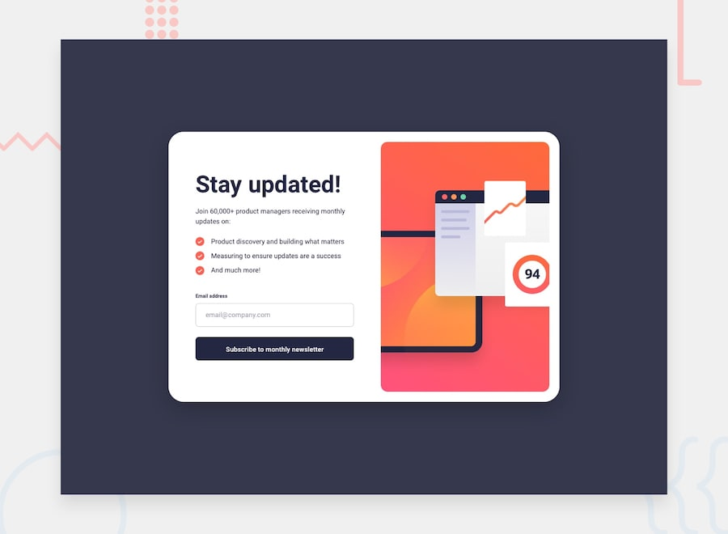

# Frontend Mentor - Newsletter sign-up form with success message solution

This is a solution to the [Newsletter sign-up form with success message challenge on Frontend Mentor](https://www.frontendmentor.io/challenges/newsletter-signup-form-with-success-message-3FC1AZbNrv). Frontend Mentor challenges help you improve your coding skills by building realistic projects.

## Table of contents

- [Overview](#overview)
  - [The challenge](#the-challenge)
  - [Screenshot](#screenshot)
  - [Links](#links)
- [My process](#my-process)
  - [Built with](#built-with)
  - [What I learned](#what-i-learned)
  - [Continued development](#continued-development)
- [Author](#author)

## Overview

### The challenge

Users should be able to:

- Add their email and submit the form
- See a success message with their email after successfully submitting the form
- See form validation messages if:
  - The field is left empty
  - The email address is not formatted correctly
- View the optimal layout for the interface depending on their device's screen size
- See hover and focus states for all interactive elements on the page

### Screenshot

### Links

- Solution URL: [GitHub Repository](https://github.com/your-username/newsletter-sign-up-with-success-message)
- Live Site URL: [Live Demo](https://your-username.github.io/newsletter-sign-up-with-success-message)

## My process

### Built with

- Semantic HTML5 markup
- CSS custom properties
- Flexbox
- CSS Grid
- Mobile-first workflow
- Vanilla JavaScript

### What I learned

This project helped me practice form validation, state management with JavaScript, and responsive design techniques. I learned how to create smooth transitions between different UI states and implement proper error handling for user inputs.

Key learnings include:

- Using CSS Grid for layout and Flexbox for component alignment
- Implementing client-side email validation with regex
- Managing DOM manipulation for showing/hiding elements
- Creating responsive designs that work on both desktop and mobile

### Continued development

In future projects, I want to focus on:

- Improving accessibility features
- Adding more advanced form validation
- Implementing animations and transitions
- Learning about form submission to backend services

## Author

- GitHub - [@batgev](https://github.com/batgev)
